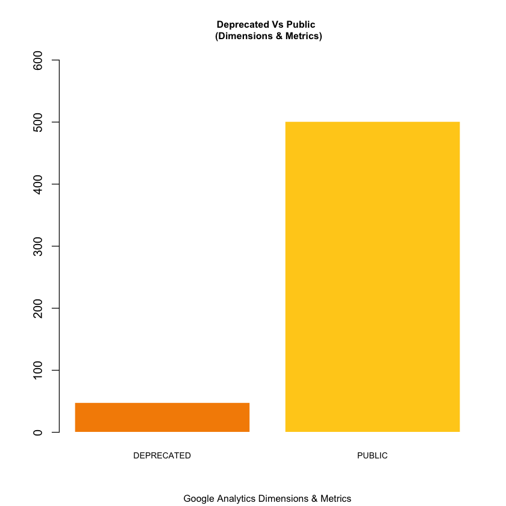

```R
library(jsonlite)
library(data.table)
metada_api_url <- "https://www.googleapis.com/analytics/v3/metadata/ga/columns?pp=1"
metada_api_response <- fromJSON(metada_api_url, flatten = T)

ga_dimension_and_metrics <- as.data.table(metada_api_response$items)

vars <- c("attributes.type", "attributes.group", "attributes.status", "attributes.allowedInSegments", "attributes.addedInApiVersion")
ga_dimension_and_metrics <- ga_dimension_and_metrics[,(vars):=lapply(.SD, as.factor),.SDcols=vars]

# Here I only keep relevant variables provided by the metadata api.
vars <- c("id", "attributes.uiName", vars)
DT <- ga_dimension_and_metrics[,vars, with=F]
head(DT,5)
```


<table>
<thead><tr><th scope=col>id</th><th scope=col>attributes.uiName</th><th scope=col>attributes.type</th><th scope=col>attributes.group</th><th scope=col>attributes.status</th><th scope=col>attributes.allowedInSegments</th><th scope=col>attributes.addedInApiVersion</th></tr></thead>
<tbody>
	<tr><td>ga:userType            </td><td>User Type              </td><td>DIMENSION              </td><td>User                   </td><td>PUBLIC                 </td><td>true                   </td><td>3                      </td></tr>
	<tr><td>ga:visitorType         </td><td>User Type              </td><td>DIMENSION              </td><td>User                   </td><td>DEPRECATED             </td><td>true                   </td><td>3                      </td></tr>
	<tr><td>ga:sessionCount        </td><td>Count of Sessions      </td><td>DIMENSION              </td><td>User                   </td><td>PUBLIC                 </td><td>true                   </td><td>3                      </td></tr>
	<tr><td>ga:visitCount          </td><td>Count of Sessions      </td><td>DIMENSION              </td><td>User                   </td><td>DEPRECATED             </td><td>true                   </td><td>3                      </td></tr>
	<tr><td>ga:daysSinceLastSession</td><td>Days Since Last Session</td><td>DIMENSION              </td><td>User                   </td><td>PUBLIC                 </td><td>true                   </td><td>3                      </td></tr>
</tbody>
</table>


```R
table(DT$attributes.status)
```


    
    DEPRECATED     PUBLIC 
            48        501 


```R
barplot(table(DT$attributes.status))
```


```R
barplot(table(DT$attributes.status), main="Deprecated Vs Public \n (Dimensions & Metrics)", sub = "Google Analytics Dimensions & Metrics",  col=c("#F58D00","#FFCE1C"), cex.main=.8, cex.sub=.8, cex.names =.7, border = "white",  ylim=c(0,1.2*max(unlist(table(DT$attributes.status)))))
```





```R

```
